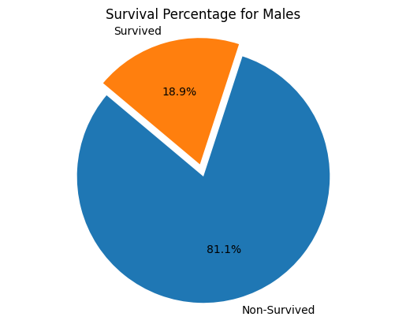
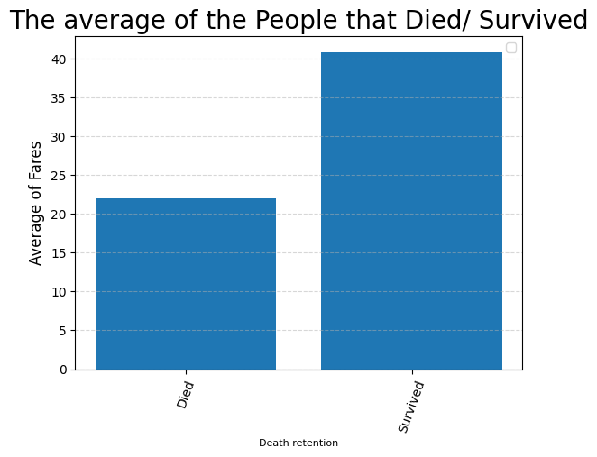
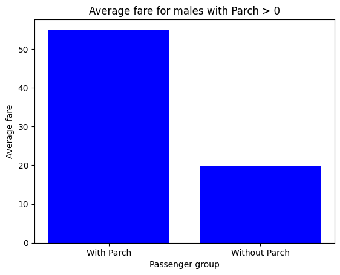

# Introdcution

The Titanic, a British passenger liner considered unsinkable, tragically sank in 1912 on its maiden voyage after colliding with an iceberg, leading to the devastating loss of over 1,500 lives. The disaster sparked global reevaluation of maritime safety and remains a poignant symbol of human hubris and the forces of nature.

# Data Gained

```This is an example of the type of data worked with throughout this whole process.```

| PassengerId | Survived | Pclass | Name | Sex | Age | SibSp | Parch | Ticket | Fare | Cabin | Embarked |
|------------|----------|--------|------|-----|-----|-------|-------|--------|------|-------|----------|
| 1          | 0        | 3      | Braund, Mr. Owen Harris    | Male   | 22   | 1     | 0     | A/5 21171      | 7.25    |      | S        |


## Question 1. 
```What is the percentage amount of males who survived?```

To complete this question I created a Pie Chart :



- The data presented in the graph reveals that exactly 18.9% of Males that boarded the titanic Survived and 81.1% Died when the Titanic went down.
## Question 2. 
```What is the average amount of money males paid in fairs that survived versus the ones that died?```

To complete this question I created a Bar Graph :



One key observation from the graph is that the amount paid in fares for the Survived is almost twice the amount paid in fares for the people that Died.
## Question 3. 
```What amount paid in fares of Males had at least one other relative with them on the trip?```

To complete this question I created a Bar Graph :



- One key observation from the graph is if the male had parch with them then they would end up paying more money than if they didn't

# Conclusion

In summary, the analysis of the Titanic dataset revealed that only 18.9% of males survived, and survivors paid significantly higher fares on average. Males traveling with at least one relative also tended to pay higher fares. These findings highlight the challenges faced by male passengers and the economic deaths among passengers during the Titanic's tragic fall.

If you want to view my full code that created my graphs you can view them here: https://github.com/theylovecjawn/blog/blob/main/_posts/2023-11-05-Titanic-Analytics.md